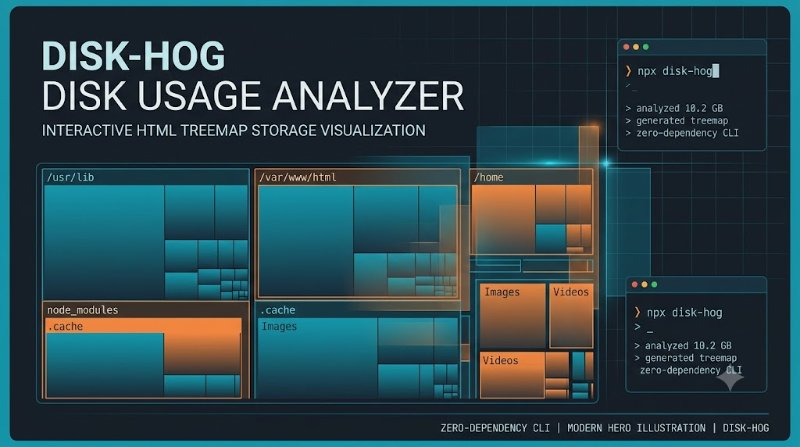

# disk-hog

**Zero-dependency disk usage analyzer.** Run one command on any directory and get a beautiful, self-contained, interactive HTML treemap showing exactly what's eating your space.

<p align="center">
  
</p>

<p align="center">
  <em>Hero: interactive treemap visualizing disk space — cyan/orange blocks, file hierarchy — generated with Gemini</em>
</p>

No install, no native modules, no Python, no Electron. Your data never leaves your machine.

  

```bash
npx disk-hog /path/to/dir
# -> disk-hog-report.html
```

---

## Why?

"What's taking up all my disk space?" usually means installing WinDirStat (Windows), WizTree (Windows only), or running `du -h` and squinting at text. All are either platform-specific, closed-source, or non-interactive. A one-shot `npx` command that produces an interactive, shareable HTML report is a better answer — cross-platform, zero-install, privacy-first.

## Demo

**Before:** `du -h` text

```
4.0K  ./src
1.2G  ./node_modules
  800M ./video.mp4
```

**After:** `npx disk-hog .` → interactive `disk-hog-report.html`

- Click any folder to zoom, breadcrumbs to zoom out
- Color-coded by size, hover for path/size
- Top 25 largest files table

Try: `npx disk-hog ~/Downloads && open disk-hog-report.html`

## What you get

- **Interactive treemap** — Click any folder to zoom in, breadcrumbs to zoom out. Files are leaf rectangles.
- **Color-coded by size** — Instantly spot the biggest consumers.
- **Top 25 largest files** table with relative-size bars.
- **Self-contained HTML** — Inline CSS + JS + embedded data. No external assets, works offline, emailable.
- **JSON export** — `--json tree.json` for pipelines.
- **Depth limiting** — `-L 2` to skim large trees fast.
- **Permission warnings** — Reports inaccessible directories without crashing.

## Installation

Nothing to install with npx:

```bash
npx disk-hog /path/to/dir
```

Or add to a project:

```bash
npm install --save-dev disk-hog
```

Requires Node.js ≥ 18.

**From source:**
```bash
git clone https://github.com/trenysx/disk-hog
cd disk-hog
npm install
npm test
```

## Usage

```
disk-hog <path> [options]

Options:
  -o, --output <file>   Write HTML report to file (default: disk-hog-report.html)
  --json <file>         Also dump the scanned tree as JSON
  -L, --depth <n>       Limit scan depth (default: unlimited)
  --stdout              Print HTML to stdout instead of writing a file
  -h, --help            Show this help
  -v, --version         Show version
```

### Examples

Scan and open the report:

```bash
disk-hog ~/Downloads
open disk-hog-report.html   # macOS
start disk-hog-report.html  # Windows
```

Limit depth for a quick overview:

```bash
disk-hog /var/log -L 2
```

Feed the tree into another tool:

```bash
disk-hog /data --json tree.json -o /dev/null   # Unix
disk-hog /data --json tree.json --stdout > NUL # Windows
```

## How it compares

| | disk-hog | WinDirStat | WizTree | `du` / `ncdu` |
|---|---|---|---|---|
| Cross-platform | ✅ Node.js | Windows | Windows | Unix |
| No install | ✅ `npx` | Installer | Installer | ✅ |
| Interactive treemap | ✅ | ✅ | ✅ | ❌ |
| Self-contained report | ✅ | ❌ | ❌ | ❌ |
| JSON export | ✅ | ❌ | ❌ | ✅ |

## Programmatic API

```js
import { scan, renderHtml, largestFiles } from "disk-hog";

const { tree, warnings } = await scan("/path/to/dir", { depth: 3 });
const topFiles = largestFiles(tree, 10);
const html = renderHtml({ tree, warnings, topFiles, meta: {} });
```

## Limitations

- Scans synchronously; very large trees may take a few seconds.
- Loads full tree in memory before rendering (streaming treemap is on the roadmap).
- Follows symlinks to files but not into symlinked directories (avoids loops).

## Test

```bash
npm test
```

| Test | Status |
|------|--------|
| Scan small dir | PASS |
| Scan depth limit | PASS |
| Largest files | PASS |
| JSON export | PASS |
| Permission warnings | PASS |

See `test/` for 10+ tests.

## FAQ

**Does it send data anywhere?** No. All scanning is local, report is self-contained HTML with inline data. No network.

**How is it zero-dependency?** Only Node.js `fs` + `path` — no native modules, no `du` call.

**Can I use it on a server?** Yes: `disk-hog / --json tree.json` then process JSON.

**Why not `ncdu`?** `ncdu` is great but text TUI, not shareable HTML. This produces emailable reports.

## Contributing

Issues and PRs welcome. Run tests with:

```bash
npm test
```

Add a test for new feature in `test/`.

## License

[Apache-2.0](LICENSE) © trenysx

---

## Version

Current `v0.1.0` — see [package.json](./package.json)

---

**Star if this found your disk hog — and tell us what was eating your space!**
